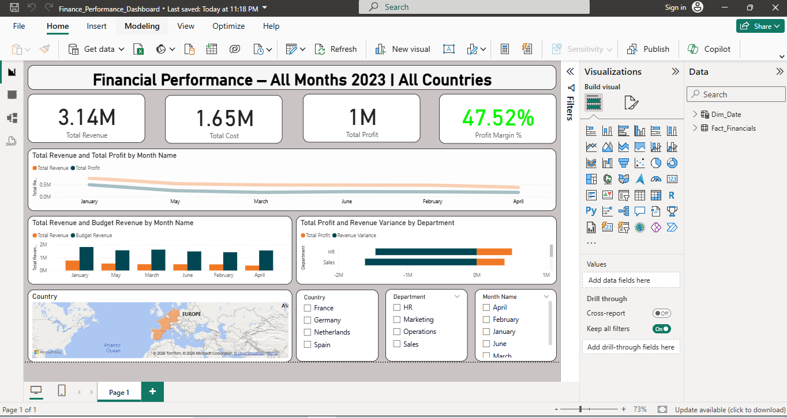

# 📊 Financial Performance Dashboard (Power BI)

## 📌 Overview

This project is an interactive **Financial Performance Dashboard** built using Power BI.  
It analyzes revenue, cost, profit, and budget variance across multiple months, departments, and countries for 2023.

The dashboard enables dynamic filtering and provides clear, data-driven insights into overall company performance.

---

## 📷 Dashboard Preview

---

## 🔍 Dashboard Structure

### Executive KPI Cards
- Total Revenue  
- Total Cost  
- Total Profit  
- Profit Margin (%)  

### Revenue & Profit Trend
- Monthly trend analysis to monitor performance over time.

### Revenue vs Budget Comparison
- Identifies performance gaps against planned targets.

### Department Variance Analysis
- Highlights over- and under-performing business units.

### Geographical Performance
- Country-level revenue distribution.

### Interactive Slicers
- Month  
- Department  
- Country  

---

## 🛠 Tools & Technologies Used

- Power BI  
- DAX (Data Analysis Expressions)  
- Data Modeling (Star Schema)  
- Custom Date Dimension (Calendar Table)  
- KPI Cards & Variance Analysis  
- Interactive Slicers  

---

## 🗂 Data Model

The report follows a clean **star schema** structure:

- **Fact_Financials** – Transaction-level financial data  
- **Dim_Date** – Custom calendar table for time intelligence  

**Relationship:**  
- One-to-Many (1:*) between `Dim_Date` and `Fact_Financials`

---

## 📊 Key Features

- Dynamic title reflecting selected month and country  
- Revenue, Cost, Profit & Profit Margin KPIs  
- Revenue vs Budget comparison  
- Profit variance by department  
- Monthly revenue and profit trend analysis  
- Fully interactive filtering  

---

## 📈 Business Insights

- Revenue shows consistent growth across early months of 2023  
- Profit margin remains stable at approximately 45–48%  
- Certain departments show negative budget variance  
- Revenue peak observed in Q2  

---

## 🧠 Learning Outcomes

Through this project, I strengthened my ability to:

- Build a custom date dimension table  
- Manage relationships and cardinality (1:*)  
- Develop DAX measures for KPIs and variance analysis  
- Design structured and interactive dashboards  
- Implement dynamic report titles  

---

## 🚀 Future Improvements

- Add Month-over-Month growth analysis  
- Implement financial forecasting  
- Enhance visual styling and layout refinement  
